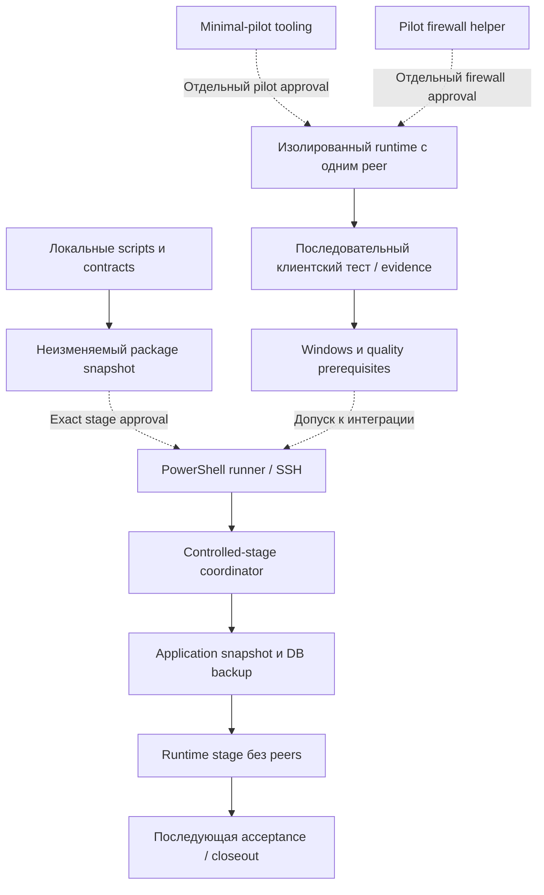

# Архитектура AMN3 / VPS-OPS-LAB

Дата: 2026-09-07. Основание: статическое чтение локальных исходников на
`a4a592636b648550fa9c98dc1f084db9690615d1` и актуального плана Phase 16.
Это архитектура инструментов этого репозитория, не аудит production AMN2,
не новый design и не live-инвентаризация. [Вход](START_HERE.ru.md),
[паспорт](PROJECT_PASSPORT.ru.md), [карта кода](CODE_MAP.ru.md).

## Слои и ответственность

| Слой | Реализация здесь | Граница |
| --- | --- | --- |
| Решения и доказательства | `docs/`, `research/`, `ideas/`, `watch-notes/` | Датированный receipt не является командой или текущим runtime-состоянием |
| Контракты и подготовка | Python в `scripts/`, JSON contracts в `packaging/` | Materialization создаёт файлы; verifier не доказывает успешный stage |
| Операторский транспорт | PowerShell runners в `scripts/vps/` | SSH и локальные journals требуют разрешённого scope; слово readonly относится к выбранному remote collector |
| Исполнение на target | Shell/Python remote stage, support и pilot-модули | Docker, systemd, firewall, backup/config writes — отдельные реальные side effects |
| Проверки | `tests/`: Python unittest/pytest, synthetic subprocess harnesses и binding checks | Наличие/успех локального теста не заменяет клиентское качество и live acceptance |

AMN2 — отдельный владелец production-приложения и схемы его БД. `source/` внутри
пакета — связанный с версией snapshot для переноса, а не второй рабочий исходник.
В этом пакете документации source snapshots и соседний репозиторий не анализировались.

## Два разных пути Phase 16

Схема показывает назначение и поток артефактов, не граф Python imports и не
текущее состояние VPS. Пунктир обозначает условие допуска или отдельное разрешение.
По активному плану Windows и quality gates должны предшествовать новой интеграции;
наличие готового пакета не позволяет обойти эту зависимость.

### Контролируемая интеграция

1. [Package tooling](../scripts/phase16_awg31_package.py) собирает разрешённые
   source/tooling payloads и manifest с идентичностью; `verify_package` проверяет
   контракт пакета. Текущий package ID в исходнике — 016, не разрешение пересборки.
2. [Preflight contract](../scripts/phase16_preflight_contract.py) задаёт claim,
   срок/статус, canonical JSON, observations и нормализованные outcomes.
   [SSH runner](../scripts/vps/phase16_spain_readonly_preflight_ssh_runner.ps1)
   выполняет транспорт и ведёт локальные transaction/outcome записи.
   Remote read-only preflight не означает отсутствие любых локальных записей.
3. [Controlled-stage runner](../scripts/vps/phase16_controlled_stage_ssh_runner.ps1)
   использует helpers preflight runner, проверяет exact approval и формирует
   ограниченный framed package/coordinator payload для SSH.
4. [Coordinator](../scripts/vps/phase16_controlled_stage_coordinator.py) проверяет
   package/request/coordinator binding, фиксирует milestones и AWG2 snapshot,
   выдаёт claims и последовательно вызывает application-stage, затем runtime-stage.
   Ошибки имеют failure locus. При неподтверждённом завершении stage результат
   `recovery_required` запрещает cleanup координатором; package, имеющийся backup
   и ресурсы сохраняются, но остановка дочерних процессов этим не доказана.
   `rollback_failed` означает обнаруженную ошибку cleanup; `rolled_back` без
   readback (`attempts_completed_unverified`) не подтверждает восстановление.
   Отдельные gates задаёт [согласованный recovery-контракт v1](superpowers/specs/2026-09-08-phase16-controlled-stage-recovery-contract.ru.md);
   автоматический recovery не реализован. Это поведение mutable source,
   не подтверждение развёртывания исправлений в immutable package016 или на VPS.
5. [Application-stage](../scripts/vps/phase16_application_stage_remote.sh)
   создаёт backup SQLite, сохраняет release snapshot и stage ledger. Это не
   доказательство переключения работающего приложения или завершённой интеграции.
6. [Runtime-stage](../scripts/vps/phase16_awg31_runtime_stage_remote.sh)
   загружает pinned image, создаёт server-only config, сеть и systemd unit,
   запускает сервис и проверяет отсутствие peers. Общая issuance остаётся выключенной.

### Минимальный пилот

[Minimal-pilot](../scripts/vps/phase16_awg31_minimal_pilot.py) — отдельный путь:
`render` подготавливает защищённую пару профилей, `check` читает состояние target,
`apply` проверяет hash/state/claim, затем создаёт сеть и контейнер для одного peer.
Подготовка требует два явно заданных IPv4 DNS; legacy single DNS сохранён в
валидации/рендеринге. Это локальная совместимость генератора, не изменение live-профиля.

В `apply` есть image pull, native validation, resource creation и AWG2 equality
check. Rollback удаляет только установленные ownership-проверкой ресурсы;
image cache, inputs и consumed claim могут остаться. Не трактовать STOP как
доказательство полной очистки или разрешение повторить попытку.

[Firewall helper](../scripts/vps/phase16_awg31_pilot_firewall.py) строит временный
nft batch и проверяет ownership/baseline; `apply_rules` использует переданные
исполняющие callbacks. При реальном backend он меняет firewall и может выполнять
rollback. Отсутствие remote execution на import не делает apply read-only.

Путь трафика пилота: один клиент → UDP 30002 target → host firewall/forwarding/NAT
→ изолированный container/network → внешний адресат. Это логическое описание
исторически проверенного IPv4 пути, не новая проверка маршрута или IPv6 leak safety.
Pilot и integrated runtime не считаются взаимозаменяемыми или безопасными для
одновременного запуска: ресурсы проверяются отдельным state-bound gate.

## Данные и доверие

- Package manifest: идентичность, состав и hashes. См.
  [package-manifest schema](../packaging/phase16-awg3-family-3-1-spain-pilot-contract/package-manifest.schema.json).
- Claim/request: scope, bindings, срок и одноразовое использование. Это технический
  контракт; наличие объекта без соответствующего операторского approval недостаточно.
- Evidence/outcome: observations, milestones, failure locus и результат; см.
  [preflight schema](../packaging/phase16-awg3-family-3-1-spain-pilot-contract/preflight-evidence.schema.json)
  и [failure schema](../packaging/phase16-awg3-family-3-1-spain-pilot-contract/failure-outcome.schema.json).
- Profiles/keys и реальные DB backups — чувствительные артефакты вне Git.
  [Stage support](../scripts/vps/phase16_stage_support.py) содержит online SQLite
  backup и генерацию server config/unit; это не источник полной схемы БД приложения.

ER-схема здесь намеренно не нарисована. SQL в plans и импорт `sqlite3` не доказывают
актуальные таблицы/связи. Для будущей ER-схемы нужен отдельно разрешённый анализ
актуальных schema/migrations в AMN2, без чтения production-данных по умолчанию.

## Что архитектура не подтверждает

Наличие controlled-stage кода не устраняет прежний transport defect и не закрывает
Task 3B. Минимальный runtime и client connectivity не закрывают Windows/quality
blockers, persistence, reconnect/stability acceptance или rollback acceptance.
Очередь и отложенные проверки — только в [активном плане](superpowers/plans/2026-08-24-amn2-phase16-awg3-family-3-1-spain-pilot.md).

Обновлять этот обзор при изменении границ компонентов, формата артефактов или
порядка stage/pilot. Подробные функции и тесты искать через CODE_MAP; не добавлять
сюда хронику прогонов. Прочитаны ключевые пути, это не полный security/code audit.
