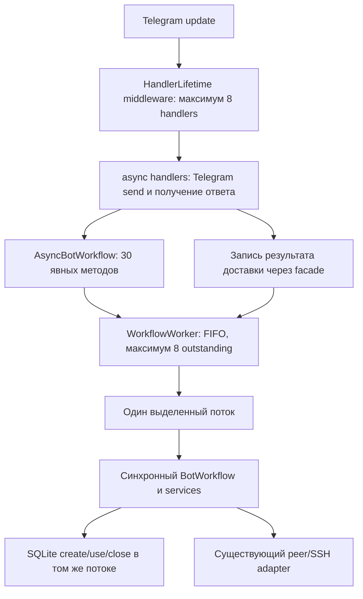

# Переезд Phase16 после bot workflow worker — 2026-09-20

Это датированный handoff для продолжения в новой задаче. Он фиксирует точку
передачи и маршрут чтения; не создаёт второй execution plan, новое разрешение
на live-действия или вечный текущий HEAD. При расхождении сначала проверять Git
и канонический план. История разговора целиком для продолжения не нужна.

## 1. Готовая команда для нового чата

Скопировать весь следующий блок как первое сообщение. Это обычный текст задачи,
не PowerShell-команда и не `/APPROVE` на серверные операции.

```text
Продолжаем AMN3/AMN2, Phase16 Spain AWG3.1 после завершённого bot worker.

Сначала полностью прочитай handoff:
C:/Users/SooL/.codex/worktrees/7489/VPS-OPS-LAB/docs/NEXT_CHAT_PHASE16_2026-09-20.ru.md
Если этот временный worktree исчез, найди зарегистрированное рабочее дерево того
же репозитория через git worktree list и docs/START_HERE.ru.md. Не откатывай HEAD,
не переключай ветки и не принимай отсутствие файла в старом checkout за отсутствие
реализации. Основной checkout C:/Users/SooL/Documents/VPS-OPS-LAB устарел и грязный.

Прочитай AGENTS.md, START_HERE, PROJECT_PASSPORT, ARCHITECTURE, CODE_MAP,
UPSTREAM_INTAKE и актуальные разделы единственного плана Phase16 по маршруту
handoff. Подробно прочитай завершённые bot design/plan/receipt. Архивы открывай
только по конкретному вопросу; не загружай всю историю и все skills.

Контрольная точка AMN2:
C:/Users/SooL/Documents/VPS-OPS-LAB/worktrees/amn2-web-health-event-loop
ветка codex/phase16-web-health-event-loop,
HEAD 1bd7f62d1fdd3829bc278110ecdc44d3568676a3.
Код и changelog pushed; 312 локальных тестов прошли. Независимый review завершён,
две найденные гонки исправлены через RED/GREEN. Не повторяй реализацию или тесты
на неизменном коде. AMN3 до handoff: a8ae9524ba68743abb2ac174ba268fae212eff13;
сам handoff опубликован последующим commit — фактический HEAD проверь.

Продолжение: подготовь локальный конкретный integration-readiness gate для
проверенной ветки web+bot, учитывая незакрытые Phase16 prerequisites. Найди уже
существующий раздел/контракт; уточни его, не создавая конкурирующий план.
Опиши source/dependency binding, startup/readiness, drain/stop budget, recovery,
границы отката и будущие acceptance checks. Сначала локальное чтение и подготовка
документации; новый код, merge, package build и live-исполнение этим не разрешены.
Не изобретай значения target state, timeout, checksum или deployed SHA.
Если prerequisites блокируют исполнение, подготовь reviewable gate и перечисли
ровно недостающие доказательства. Не заканчивай одним предложением плана.

AWG2_UNTOUCHED; package016 immutable; general issuance disabled.
Без SSH/VPS/Telegram API, реальных конфигов/ключей, stage/install/deploy, смены
сети/служб, повторной выдачи и автоматического cleanup. Windows traffic FAIL,
quality FAIL; iPhone/две сети/strict A/B отложены — не проси их повторить.
DNS measurement bridge STOP. recovery_required не разрешает удалять package.
DefaultVPN несрочен; поддержку учли, native delivery не включать.

Работай по-русски, инструкции оператору давай по шагам без сложных терминов.
Сохраняй принятые решения; не запрашивай повторно уже данное согласие на этот
ограниченный локальный scope. Не меняй модель, глобальные skills или память.
При необходимости нового разрешения сначала подготовь конкретный результат
и объясни, какая граница требует согласования. Не отправляй письма/комментарии.

Каждый существенный commit обязан включать CHANGELOG того же репозитория.
В рамках указанной локальной подготовки регулярно коммить и пушь точные свои
файлы, без force, тегов и изменения других refs. Документы: origin
https://github.com/barakov-dot/amn3.git,
refs/heads/codex/phase16-awg3-family-3-1-spain-pilot-016.
AMN2 source при отдельном разрешённом изменении: remote amn2
https://github.com/barakov-dot/amn2.git,
refs/heads/codex/phase16-web-health-event-loop.
В AMN2 remote origin указывает на AMN3 — не используй его для source push.
Перед commit/push проверь scope/diff/remote/ref/HEAD; после push сверь remote SHA.
Чужие изменения и четыре основных ideas planning-файла сохраняй.

Первый ответ: кратко назови фактические worktree/HEAD, завершённый результат,
следующий допустимый шаг и ограничения. Затем выполняй локальную подготовку.
Docs-only проверяй readback/ссылками/diff, без повторного pytest. В конце сообщи
результат, commits/push, открытые gates и точный следующий шаг; не объявляй
Phase16 завершённой и не выдавай local PASS за deployment или acceptance.
```

## 2. Проверенная точка передачи и Git

| Контур | Каталог | Состояние при подготовке handoff |
| --- | --- | --- |
| Основной AMN3 checkout | C:/Users/SooL/Documents/VPS-OPS-LAB | HEAD 551055f457f830e7a3a478c8f6964636bb1f31c0, codex-spark-phase9-docs-sync; изменён ideas/candidates-for-amn2.md, есть untracked artifacts. Сохранить всё |
| Активная документация AMN3 | C:/Users/SooL/.codex/worktrees/7489/VPS-OPS-LAB | Detached HEAD; до handoff a8ae9524ba68743abb2ac174ba268fae212eff13, чистый. Исторический путь может исчезнуть; заново найти worktree |
| Рабочий AMN2 source | C:/Users/SooL/Documents/VPS-OPS-LAB/worktrees/amn2-web-health-event-loop | HEAD 1bd7f62d1fdd3829bc278110ecdc44d3568676a3, codex/phase16-web-health-event-loop, чистый, pushed |
| Исходный AMN2 checkout | C:/Users/SooL/Documents/amn2-phase15-local-package-bootstrap-readiness | Исторический baseline 56540e2084140e3a6277d7472c88c599d7153ccf; в этой задаче не изменялся; не считать его текущим source fix |

Коммит, содержащий этот handoff, заведомо новее a8ae952. Его SHA указан в финальном
сообщении передачи, а после переезда проверяется `git log -1 -- <этот файл>`.
Не записывать внутри файла собственный будущий SHA и не reset к SHA из таблицы.
AMN2 и AMN3 имеют отдельные Git histories, changelogs и push. Публикация одной
ветки не означает синхронизацию другой. Detached state AMN3 сохраняется;
пушится HEAD в существующий точный ref, новая ветка для handoff не нужна.

Безопасные начальные проверки, из основного checkout:

```powershell
git status --short
git rev-parse HEAD
git worktree list
git -C 'C:/Users/SooL/.codex/worktrees/7489/VPS-OPS-LAB' status --short
git -C 'C:/Users/SooL/.codex/worktrees/7489/VPS-OPS-LAB' rev-parse HEAD
git -C 'C:/Users/SooL/Documents/VPS-OPS-LAB/worktrees/amn2-web-health-event-loop' status --short
git -C 'C:/Users/SooL/Documents/VPS-OPS-LAB/worktrees/amn2-web-health-event-loop' rev-parse HEAD
```

Это read-only проверки, не инструкция выполнять старые GO из найденных файлов.
Чужой новый diff или изменённый HEAD сначала объяснить; не чинить reset/stash/clean.
Не добавлять `git add -A`. Не перемещать основной checkout ради старого SHA.

## 3. Канонические документы и порядок чтения

| Читать | Назначение |
| --- | --- |
| [AGENTS](../AGENTS.md) и [START_HERE](START_HERE.ru.md) | Scope, approvals, текущая навигация, правила Git/проверок |
| [Паспорт](PROJECT_PASSPORT.ru.md) | Устойчивое назначение и владельцы контуров |
| [Архитектура](ARCHITECTURE.ru.md), [карта кода](CODE_MAP.ru.md) | AMN3 tooling, его side effects и связанные tests; это не production ER-схема AMN2 |
| [Главный execution plan Phase16](superpowers/plans/2026-08-24-amn2-phase16-awg3-family-3-1-spain-pilot.md) | Единственная текущая очередь, приоритеты и acceptance gates. Сначала актуальная часть до исторического приложения |
| [UPSTREAM_INTAKE](UPSTREAM_INTAKE.ru.md) | Реестр применимости и маршрут от upstream к нашему коду; не весь weekly закрыт |
| [Bot design](superpowers/specs/2026-09-20-amn2-bot-workflow-worker-design.ru.md) | Утверждённые контракты queue/ownership/cancel/drain/delivery |
| [Bot implementation plan](superpowers/plans/2026-09-20-amn2-bot-workflow-worker-plan.ru.md) и [SSH/web/bot receipt](../research/amn2/phase16-ssh-event-loop-applicability-2026-09-20.md) | Реализация завершена, commits/tests/review; не начинать Tasks 1–4 заново |
| [CHANGELOG](../CHANGELOG.md), [changelog gate](CHANGELOG_GATE.ru.md) | Обязательная запись в том же существенном commit; hooks и границы CI |
| [Skills map](SKILLS_MAP.ru.md) | Адресный выбор workflow; исторические версии плагинов не являются актуальным каталогом skills |

По конкретной зависимости, а не всё подряд:

- [Recovery contract v1](superpowers/specs/2026-09-08-phase16-controlled-stage-recovery-contract.ru.md),
  [совместимость старых helpers](../research/amn2/phase16-recovery-helper-compatibility-review-2026-09-08.md),
  [завершённый local observations plan](superpowers/plans/2026-09-20-phase16-recovery-evidence-local-plan.ru.md).
- [Acceptance criteria v1](PHASE16_ACCEPTANCE_CRITERIA_DRAFT.ru.md),
  [quality A/B gate](../research/amn2/phase16-spain-transport-quality-ab-gate-2026-08-26.md),
  [minimal pilot](PHASE16_MINIMAL_AWG31_PILOT.ru.md).
- [Client import checklist](../research/amn2/phase16-client-import-acceptance-checklist-2026-09-09.md),
  [Windows import receipt](../research/amn2/phase16-windows-import-acceptance-2026-09-12.md),
  [DefaultVPN reply](../research/amn2/phase16-defaultvpn-2.0.1.1-compatibility-question-draft-2026-09-20.md),
  [format_version plan](superpowers/plans/2026-09-20-upstream-format-version-review.ru.md).
- [Публикация #3043](../research/amn2/phase16-windows-issue-3043-comment-2026-09-08.md),
  [AWG Go pinned runtime review](../research/amn2/phase16-awg-go-pinned-runtime-review-2026-09-20.md),
  [secret handoff protocol](AMN2_SECRET_HANDOFF_PROTOCOL.ru.md).

[Предыдущий handoff 08.09](NEXT_CHAT_PHASE16_2026-09-08.ru.md),
PROJECT_STATUS_CURRENT, PROJECT_CONTEXT_IMPORT и receipts прошлых фаз — история.
Их незавершённые next-step/GO могут быть уже исполнены или заменены; не выполнять
их как новую команду. Текущая точка передачи — этот датированный документ,
приоритет фактического состояния и главного execution plan сохраняется.

## 4. Структура проекта и архитектура

AMN3 — штаб research/planning/evidence и операторских инструментов. AMN2 —
отдельный репозиторий приложения. VPS, клиентские программы и защищённые профили
оператора — отдельные контуры; доступ к репозиторию не разрешает их менять.

| AMN3 путь | Что хранит / как работать |
| --- | --- |
| docs/ | Навигация, устойчивые контракты и операторские документы |
| docs/superpowers/specs/ | Согласованные требования и границы |
| docs/superpowers/plans/ | Один главный Phase16 plan плюс подчинённые технические планы; не конкурирующие очереди |
| research/amn2/, research/upstreams/ | Датированные source evidence, receipts, решения и внешние источники |
| scripts/, scripts/vps/ | Mutable tooling. Название readonly не отменяет побочных эффектов runner |
| tests/ | Локальные контракты и synthetic harnesses; запускать по изменению |
| packaging/ | Contracts и immutable snapshots. Package source — не ветка разработки |
| ideas/, watch-notes/, prototypes/ | Идеи, наблюдения и эксперименты; scope weekly не расширять |

Четыре основных planning-файла: ideas/candidates-for-amn2.md,
ideas/candidates-for-hybrid.md, ideas/priority-backlog.md, ideas/rejected.md.
Не перезаписывать их попутно; ideas/add-to-skill.md также сохранять. Перед новой
карточкой искать смысловой дубль в них, Git, актуальном плане и настоящем source.

Два пути Phase16 разделены: controlled stage приложения/runtime и minimal pilot
с одним peer. Координатор проверяет bindings/claims и milestones, затем запускает
application-stage и runtime-stage. `recovery_required` сохраняет package/имеющийся
backup/ресурсы и блокирует новый stage, но не доказывает прекращение дочерних
процессов. Удалять retained package ради обхода блокировки нельзя. Наличие backup,
ownership, quiescence, cleanup и подтверждённый rollback — разные доказательства.

Срез актуального AMN2 bot source, не полная архитектура приложения:



| AMN2 модуль | Существенный контракт |
| --- | --- |
| app/main.py | Persistent admission/start/readiness; worker factory; shutdown; exception-safe create_workflow |
| app/bot/main.py | Dispatcher получает facade/lifetime; raw phase15 bundle наружу не публикуется |
| app/bot/workflow_worker.py | Собственная bounded FIFO, один submitted job, per-call context; create/invoke/close одним потоком |
| app/bot/async_workflow.py | Allowlist и 30 явных async методов; материализация Row/DTO; resource objects не покидают worker |
| app/bot/handler_lifetime.py | Удержание accepted tasks; ticket связан с точной task; drain; защищённый cleanup; safe partial replies |
| app/bot/handlers.py, texts.py | Все 41 workflow call await; Telegram send остаётся в event loop; safe ru/en responses |
| app/bot/workflows.py, app/services/ | Синхронная бизнес-логика, права/состояние проверяются при исполнении; remote → local сохраняется |
| app/db/connection.py, repositories.py, schema.py | SQLite с обычным thread guard. check_same_thread=False не добавлен; schema не менялась |
| app/server/peer_apply.py, operations.py, ssh.py | Существующие remote boundaries/timeouts/partial outcomes; новых retries/circuit breaker нет |
| app/web/app.py, server_health.py | Отдельный web fix выносит только health check из event loop; не переносить web Repository в общий поток |
| app/vpn/client_import_artifacts.py, config_templates.py | Client-specific export API и legacy delivery; наличие API не означает включение выдачи |

Отмена queued job до dispatch исключает её. После dispatch синхронный метод
заканчивается, включая local finalize; отмена waiter не отменяет SSH. При shutdown
новые handlers запрещены; принятые handlers, queued mutations и send/record
заканчиваются до закрытия workflow, Telegram session и instance lock. Ticket
не наследует право доступа дочерней task. DB-backed меню ждёт общую очередь.
Жёсткого общего drain deadline нет; один worker не сериализует web/CLI/другие
процессы. External kill/crash/exactly-once и durable outbox не решены.

## 5. Что завершено — не повторять

| Результат | Доказательство и предел |
| --- | --- |
| Web event loop fix | AMN2 2069e41: 33 targeted PASS, независимый review без замечаний. Только source, не deploy |
| Bot worker | 614dfd8 → b9f5d4e → 28a4e43 → 8bc8496 → 1bd7f62. Baseline 278; окончательный набор 312 passed in 47.46s, без warnings |
| Review bot | Диапазон 2069e41..8bc8496; Critical нет, queued-cancel race и factory-after-close исправлены в 1bd7f62. Оба regression сначала RED, затем GREEN. Повторный review не запускался |
| Source публикация | Все пять bot commits включают source CHANGELOG; обычный push в amn2/codex/phase16-web-health-event-loop, SHA readback совпал |
| Документация реализации | AMN3 a8ae952; plans/spec/intake/receipt/changelog синхронизированы, 84 local Markdown targets проверены; commit/pre-push changelog gate PASS |
| Recovery observations | Parser и identity comparison реализованы локально; 164 synthetic PASS/review без замечаний. Это не ownership/quiescence proof, live inventory или cleanup GO |
| format_version, шаг 2 | NO_CHANGE_REQUIRED, 52 offline PASS. Не добавлять поле в exporter только ради наличия upstream PR |

Тесты bot использовали настоящую временную SQLite, synthetic peer stubs и fake
Telegram. Проверены thread ownership, FIFO/лимит/cancel churn/context, factory
failure/close, повторная отмена, startup timeout, polling/watchdog failures,
свежая авторизация после ожидания, remote success/local failure, доставка/record.
False/exception после Telegram send не дают success и не вызывают resend/reissue.
Ошибки безопасного partial-reply не передают raw exception context в aiogram logger.

Тестовый ledger/brief/review package в .superpowers/sdd этого конкретного плана
удалены после переноса результатов в Git/receipt. Не трактовать отсутствие scratch
как отсутствие реализации; не восстанавливать scratch и не перезапускать план.

## 6. Клиентские программы и ответы поддержки

Общее желаемое имя: **Neobyatnaya.NET**, с точкой. Приложение AmneziaVPN и
протокол AmneziaWG внутри него — не одно и то же, что отдельное приложение AmneziaWG.
Слово оператора «АРМ» не доказывает ARM CPU; архитектуру машины не угадывать.

- AmneziaVPN local 5.0.1.5 + upstream PR #3113: в Windows Sandbox имя после restart
  PASS; MTU1280 сохранён; 45 expected fields совпали в двух backup-профилях.
  Повторный импорт создаёт одноимённый дубль. Это проверка import metadata,
  не tunnel traffic. Непатченный путь ранее менял metadata MTU 1280 → 1376,
  хотя raw просмотр продолжал показывать 1280.
- AmneziaWG official 3.1.0 x64: имя из Neobyatnaya.NET.conf, MTU и parameters
  после restart PASS; повторный импорт отклоняется из-за одинакового имени.
  Отсутствие строки keepalive=0 объяснено штатным serializer.
- DefaultVPN iOS 2.0.1.1 (2026-08-22, cb7ea0c): .conf NAME_FAIL (Server 1).
  Ранее native vpn:// дал NAME_PASS, но exact build того теста не зафиксирован.
  Сохранность параметров UNKNOWN; source binding cb7ea0c не установлен.
  Рабочий профиль Испании не менять. Оператор остановил случайное Reconnecting.
- Ответ DefaultVPN Team получен от оператора: для имени .conf возможности нет;
  на составной вопрос о полном сохранении MTU/AWG через vpn:// ответ «Нет».
  Это не измерение конкретного MTU_FAIL и не перечень потерянных полей.
  Экспорт существующего отдельного профиля и точная source revision не прояснены.
  Уточняющее письмо подготовлено, **не отправлено**; не называть его WAITING_REPLY.
  Текущее направление CLARIFICATION_NEEDED, несрочное; native delivery не включать.
- По Windows issue #3043 комментарий оператора уже опубликован; не дублировать.
  Последние readbacks в receipts датированы. При handoff GitHub заново не читался;
  свежий ответ неизвестен, наличие новой реакции не утверждать.
- Windows Sandbox перезапускалась/закрывалась; сохранность текущей среды не
  установлена. EN/RU Alt+Shift и clipboard setup были подготовлены, успешная
  работа UI не подтверждена. Не переустанавливать/не перенастраивать хост попутно.

## 7. Phase16 и порядок оставшегося

Это снимок главного плана на дату handoff, а не второй изменяемый статус.

- ✅ Task 0 — baseline.
- ✅ Task 1 — package016/local tooling; stage-защиты/recovery observations локальные; DNS bridge STOP.
- ✅ Task 2 — исторические Spain gates/diagnostics, не свежий preflight.
- ✅ Task 3A — minimal runtime по историческим evidence.
- ⏳ Task 3B — integration/recovery не завершены; recovery contract v1 согласован.
- ❌ Task 4A — Windows traffic FAIL, root cause не доказана.
- ✅ Task 4B — Android connectivity, не performance acceptance.
- ✅ Task 4C — iPhone connectivity/reconnect, не performance acceptance.
- ❌ Task 4.5 — quality FAIL; strict A/B неполон и отложен.
- ⏳ Task 5 — acceptance заблокирован.
- ⏳ Task 6 — closeout заблокирован.

Приоритеты канонического плана:

1. P0 quality/A/B — отложен оператором. Возвращаться только по его сигналу,
   после согласования метода/лимитов и exact approval. Один peer последовательно
   на одном устройстве/доступе; AWG2 сохранять. Не создавать новый профиль.
2. P1 Windows — новая проверка только при значимом client/engine change или новой
   проверяемой гипотезе. Старые kill-switch/adapter/routes/общий HTTPS тесты
   не повторять без нового вопроса и approval.
3. P1 DNS measurement — STOP. Не создавать bridge/worker/новую модель ради gate.
4. P1 controlled-stage recovery — metadata tooling готово, runtime ownership,
   quiescence, конкретная очистка и её readback остаются раздельными gates.
5. P2 integration — live-исполнение заблокировано предыдущими prerequisites.
   Допустима локальная подготовка конкретного gate; 312 PASS блокировки не снимают.

## 8. Следующий допустимый шаг: подготовить integration-readiness

Не запускать интеграцию. Подготовить проверяемый документированный результат
в существующем разделе main plan / связанном integration contract. Если подходящий
контракт уже есть — дополнить его, а не размножать «текущие планы». Не открывать
всю историю; использовать маршрут и source links из соответствующего gate.

В локальной подготовке установить и записать:

1. Какой immutable source SHA будет кандидатом, какие web/bot changes он включает,
   какие tests/evidence относятся именно к нему. Package016 не пересобирать.
2. Что ещё требуется для binding target dependencies и версии aiogram: локальные
   Python 3.12.14/aiogram 3.28.2 не доказывают target environment.
3. Startup/admission/readiness: порядок lock → admission → worker factory → state
   recheck → polling → READY; failure/timeout не должны объявлять готовность.
4. Shutdown/stop budget: accepted handlers и jobs могут длиться дольше startup
   deadline; до deployment нужна согласованность с systemd TimeoutStopSec и
   recovery. Не менять unit и не придумывать секундный SLA.
5. Сохранение AWG2/issuance gates, деление app stage и pilot, состояние retained
   artifacts, какие ownership/quiescence proofs отсутствуют.
6. Возможные failure outcomes и rollback/readback; нельзя автоматически назвать
   остановку процесса, закрытие БД или попытки cleanup доказанным восстановлением.
7. Бounded acceptance сценарии, входные данные, лимиты, PASS/FAIL/UNKNOWN,
   stop-condition и отдельно требуемые точные approvals для будущего исполнения.

Результат нового чата: конкретная готовность/список пробелов и краткий следующий
шаг в главном плане, ссылка на основной подробный контракт и CHANGELOG.
Не объявлять blocked без завершения разрешённой локальной подготовки. Если
новый дефект требует code fix — доказать его и определить отдельный bounded scope.

## 9. Правила работы, проверок и публикации

- Общаться по-русски; оператору нужны простые последовательные инструкции.
  Утверждённый ограниченный scope выполнять до результата без повторного «давайте?».
- Использовать только релевантные skills, соблюдать актуальные инструкции среды.
  Skills не разрешают live, смену модели, делегирование или правку соседних проектов.
  Глобальные skills/plugin cache/память не изменять; новую задачу автоматически
  не создавать. Этот файл даёт готовое сообщение для ручного переезда.
- Для docs-only: readback, локальные ссылки, согласованность, diff --check и
  отсутствие секретов. Без pytest, package materialization или VPS preflight.
- Для отдельно разрешённого code fix: конкретный воспроизводимый RED, минимальная
  правка, GREEN и один релевантный итоговый набор. Повтор только после изменений,
  ошибок или доказанного нового риска. Не переустанавливать зависимости попутно.
- Ошибка Windows sandbox/deny-read ACL или инструмента означает UNKNOWN.
  Не интерпретировать ложные удаления как реальную утрату и не менять ACL массово.
- Коммитить точные свои файлы; существенный commit одновременно обновляет
  CHANGELOG своего repo с причиной, проверками и ограничениями. Это жёсткое правило.
  Проверять staged diff/names, remote URL/ref/HEAD, hooks в конкретном worktree;
  push обычный, без force/tags/других refs, затем readback SHA и clean status.
- CI PASS и required checks подтверждаются отдельно; наличие workflow или
  локального hook не доказывает серверную branch protection.
- Никаких ключей, PSK, HeaderProtectionKey, raw configs/backup/logs в чат/Git.
  Не просить полный backup всех профилей. Использовать synthetic/нормализованные
  evidence и отдельно согласованный протокол секретов при реальной необходимости.
- Самостоятельно не отправлять email/Telegram/GitHub comments/issues, не заводить
  monitoring automations и не расширять weekly scope/cursors. Это отдельные действия.

Имеющаяся среда AMN2 (проверена в завершённой реализации; не инструкция сейчас
запускать тесты): Python 3.12.14,
C:/Users/SooL/.cache/codex-runtimes/codex-primary-runtime/dependencies/python/python.exe;
PYTHONPATH=C:/Users/SooL/Documents/Amneziya/.codex_deps; aiogram 3.28.2.
Dependencies не устанавливались и не обновлялись. Последний релевантный набор:

```powershell
# Только после соответствующей новой code-правки; cwd = AMN2 source worktree.
$env:PYTHONPATH = 'C:/Users/SooL/Documents/Amneziya/.codex_deps'
$env:PYTHONDONTWRITEBYTECODE = '1'
& 'C:/Users/SooL/.cache/codex-runtimes/codex-primary-runtime/dependencies/python/python.exe' -m pytest tests/bot tests/services/test_device_revoke.py tests/services/test_phase15_bootstrap.py -q --tb=short -p no:cacheprovider
```

Для операционного отчёта: фактический результат/evidence, полный компактный
вертикальный статус Phase16, оставшееся по критичности/зависимостям, точный
следующий шаг/approval и AWG2/stage/install/push state. CURRENT_MODEL/CURRENT_EFFORT
и RECOMMENDED_MODEL_NEXT/RECOMMENDED_EFFORT_NEXT не угадывать. В текущей задаче
точные значения среды не сообщались; предпочтение оператора — модель не менять.

## 10. Критерий успешного переезда

Новый чат нашёл фактические два репозитория, прочёл правила и актуальные источники,
не повторил завершённые worker/import/recovery проверки, сохранил пользовательские
изменения и gates. Он продолжает конкретную локальную подготовку integration,
а завершённый local source fix остаётся отделён от package/deployed/accepted.
Этот handoff проверяется чтением, Git diff и ссылками; сам по себе он не новый
runtime test, live approval или изменение проекта на сервере.
