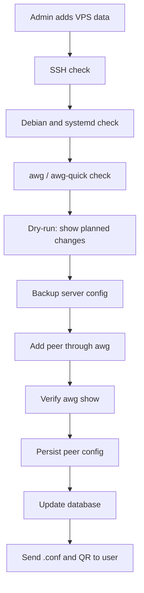

# Next Stage: Connecting a Real VPS

This guide explains what to do after the local Amneziya scaffold. The goal is to connect a real Debian VPS safely, verify the server, make backups, and only then add VPN peers.

The guide is written for beginners. If any step is unclear, stop and clarify before continuing.

## In Simple Words

The project can already work locally:

- store users, requests, and devices;
- generate VPN configs;
- encrypt secrets;
- create and restore database backups;
- run a minimal Telegram bot;
- parse `servers.yml`;
- prepare a safe `server check` command shape.

The next stage is working with a real VPS:

1. Connect to the server over SSH.
2. Check whether the server is suitable.
3. Verify or install AmneziaWG.
4. Back up the server VPN config.
5. Add a peer on the server.
6. Verify that the peer exists.
7. Send a working `.conf` to the user only after the server confirms it.

## Main Safety Rule

Do not immediately change a live server.

Safe order:

1. Check.
2. Dry-run.
3. Backup.
4. Change.
5. Verify result.
6. Mark success in the database only after verification.

If any step fails, stop.

## Overall Flow



## What You Need

On your computer:

- Amneziya project;
- Python 3.12+;
- Telegram bot token;
- `APP_SECRET_KEY`, which must not be lost;
- SSH private key or VPS password.

On VPS:

- Debian;
- SSH access;
- user with permissions for package installation and network configuration;
- open UDP port for VPN;
- `ufw` if firewall is managed through it.

## Windows 10/11 Setup

Open PowerShell:

1. Press `Win`.
2. Type `PowerShell`.
3. Open regular PowerShell.
4. Copy and paste commands from this guide.

### Project Folder

```powershell
cd C:\Users\SooL\Documents\Amneziya
dir
```

Expected files include:

```text
README.md
docs
app
tests
pyproject.toml
```

### Python 3.12+

Official links:

- Python downloads: <https://www.python.org/downloads/windows/>
- Python on Windows docs: <https://docs.python.org/3/using/windows.html>

Install through PowerShell:

```powershell
winget install Python.Python.3.12
```

Restart PowerShell and check:

```powershell
python --version
```

Install project dependencies:

```powershell
python -m pip install -e .[dev]
```

Run tests:

```powershell
python -m pytest tests -v
```

### Telegram Bot Token

Official links:

- <https://core.telegram.org/bots>
- <https://t.me/BotFather>

Create token:

1. Open Telegram.
2. Open BotFather.
3. Send `/newbot`.
4. Choose bot name and username.
5. Put the token into `.env`.

Example placeholder:

```env
TELEGRAM_BOT_TOKEN=CHANGE_ME_TOKEN_FROM_BOTFATHER
```

Never send the token to other people and never commit it to Git.

### `APP_SECRET_KEY`

`APP_SECRET_KEY` encrypts VPN private keys and PSKs in the database. Losing it means encrypted VPN secrets cannot be decrypted.

Generate:

```powershell
python -c "import secrets; print(secrets.token_urlsafe(48))"
```

Put into `.env`:

```env
APP_SECRET_KEY=CHANGE_ME_GENERATED_RANDOM_SECRET_48_PLUS_CHARS
```

Store this key separately in a safe place.

### SSH Key

Microsoft OpenSSH docs:

- <https://learn.microsoft.com/windows-server/administration/OpenSSH/openssh-overview>
- <https://learn.microsoft.com/windows-server/administration/openssh/openssh_install_firstuse>

Check SSH:

```powershell
ssh -V
```

Generate key:

```powershell
ssh-keygen -t ed25519 -f $env:USERPROFILE\.ssh\id_ed25519
```

Files:

```text
C:\Users\<your_user>\.ssh\id_ed25519
C:\Users\<your_user>\.ssh\id_ed25519.pub
```

`id_ed25519` is private. Do not share it.

Test connection:

```powershell
ssh root@YOUR_SERVER_IP
```

Exit:

```bash
exit
```

## Minimal `.env`

```powershell
notepad .env
```

Example:

```env
TELEGRAM_BOT_TOKEN=CHANGE_ME_TOKEN_FROM_BOTFATHER
APP_SECRET_KEY=CHANGE_ME_GENERATED_RANDOM_SECRET
ADMIN_TELEGRAM_IDS=123456789
DATABASE_PATH=data/amneziya.sqlite3
ACCESS_MODE=free_test
FREE_TEST_REQUIRES_APPROVAL=true
DEFAULT_PLAN_DAYS=7
MAX_DEVICES_PER_USER=5
CLIENT_DNS=1.1.1.1
CLIENT_ALLOWED_IPS=0.0.0.0/0
EXPIRATION_NOTICE_DAYS=7,5,3,1
VPN_PORT_MIN=30001
VPN_PORT_MAX=65535
VPN_SERVER_RUNTIME=host_systemd
DEFAULT_VPN_NETWORK_CIDR=10.8.0.0/24
```

Run bot:

```powershell
python -m app.main
```

Stop:

```text
Ctrl+C
```

## Important Secrets

Never send to chat and never commit:

- Telegram bot token;
- `APP_SECRET_KEY`;
- SSH private key;
- real `.conf` files;
- VPN QR codes;
- real `servers.yml`;
- backup archives.

These files must stay local:

```text
.env
servers.yml
*.sqlite3
*.conf
*.qr.png
backups/
```

## Step 1. Create `.env`

```powershell
Copy-Item .env.example .env
```

Fill required values:

```env
TELEGRAM_BOT_TOKEN=CHANGE_ME_TOKEN_FROM_BOTFATHER
APP_SECRET_KEY=CHANGE_ME_GENERATED_RANDOM_SECRET_32_PLUS_CHARS
ADMIN_TELEGRAM_IDS=123456789
CONTROL_PANEL_AUTH_METHODS=telegram_admin,password,key
CONTROL_PANEL_ADMIN_USERNAME=admin
CONTROL_PANEL_PASSWORD_HASH=
CONTROL_PANEL_PUBLIC_KEY_PATH=
DATABASE_PATH=data/amneziya.sqlite3
```

Admin access has two layers:

- Telegram bot admin access: `ADMIN_TELEGRAM_IDS` plus admins delegated later with `/admin_grant`.
- Future control panel access: `CONTROL_PANEL_AUTH_METHODS` reserves login modes for Telegram admin, password hash, and public key login.

Manual admin commands already available in the bot foundation:

```text
/admin_grant <telegram_id> [username] [first_name]
/admin_add_user <telegram_id> [username] [first_name]
/admin_create_order <telegram_id> <amneziawg_v1_5|amneziawg_v2> [plan_id]
```

The admin menu also has a `Users` section. It shows service users, whether the
user has admin rights, and active/total device counts. Manual commands remain
available as a fallback until the full button-based admin flow is added.

Bot button labels are stored in a text catalog. Russian is the default language,
and English remains available as a fallback for future interface language
switching.

The bot can create a manual user and order before the person uses `/start`.
Telegram delivery may still require the person to open the bot first; if delivery
fails, the administrator keeps the generated config package for manual transfer.

Current user bot flow:

1. User opens `/start`.
2. User selects `Request config`.
3. User selects AmneziaWG version: `amneziawg_v1_5` or `amneziawg_v2`.
4. User selects an active tariff such as `7 days` or `30 days`.
5. Bot creates an admin-review order.

Device deletion and full device reset require a separate confirmation tap. This
prevents accidental removal from the bot account area.

## Step 2. Create `servers.yml`

`servers.yml` must not be committed.

Example:

```yaml
servers:
  - name: "debian-vps-1"
    enabled: true
    location: "default"
    ssh:
      host: "YOUR_SERVER_IP"
      port: 22
      user: "root"
      auth:
        type: "key"
        private_key_path: "C:/Users/you/.ssh/id_ed25519"
    vpn:
      endpoint_host: "YOUR_SERVER_IP"
      port: "auto"
      port_min: 30001
      port_max: 65535
      interface: "awg0"
      network_cidr: "10.8.0.0/24"
      server_address: "10.8.0.1/24"
      dns: "1.1.1.1"
      allowed_ips: "0.0.0.0/0"
      max_devices: 254
    firewall:
      provider: "ufw"
      open_vpn_port: true
    runtime:
      type: "host_systemd"
      service_name: "awg-quick@awg0"
```

## Step 3. Run Local Tests

```powershell
python -m pytest tests -v
```

If tests fail, do not continue to the VPS.

## Step 4. Back Up the Local Database

Create backup:

```powershell
python -m app.cli backup create --db data/amneziya.sqlite3 --output backups
```

Verify backup:

```powershell
python -m app.cli backup verify --file backups/<backup-file>.tar.enc
```

Trial restore:

```powershell
python -m app.cli backup restore --file backups/<backup-file>.tar.enc --target-db data/restore-check.sqlite3
```

If restore fails, do not work with the server.

## Step 5. Run `server check`

```powershell
python -m app.cli server check --config servers.yml --server debian-vps-1
```

This command is designed as read-only. It must not install packages, change firewall rules, start services, or write files.

Current scaffold accepts the command and validates config. Real SSH integration is the next separate step.

Checks:

- SSH availability;
- Debian;
- `systemd`;
- `ufw` status or clear firewall situation;
- `awg` and `awg-quick`;
- selected UDP port visibility;
- whether IP forwarding can be enabled later;
- whether VPN CIDR conflicts with existing addresses.

## Step 6. Implement Dry-Run

Dry-run shows what would happen without changing the server.

Future command:

```powershell
python -m app.cli server plan --config servers.yml --server debian-vps-1
```

## Step 7. Back Up Server Config Before Changes

Before changing anything, server manager must back up the active AmneziaWG config and metadata.

Rule:

```text
No backup - no server change.
```

## Step 8. Add Peer

Only after check, dry-run, and backup:

1. Create pending device in DB.
2. Allocate VPN IP.
3. Generate keypair and config.
4. Back up server config.
5. Apply peer with `awg`.
6. Verify with `awg show`.
7. Persist server config.
8. Mark device active.
9. Send `.conf` and QR.

If server application fails, do not send a broken config to the user.

## Error Handling

SSH error: check IP, SSH port, username, key path, and server availability.

AmneziaWG install error: stop and save sanitized logs.

Peer apply error: keep device pending or failed, do not mark order fulfilled, and do not send config.

## Disaster Recovery

If the bot server is lost but the VPN VPS is alive:

1. Deploy the project on a new host.
2. Put `.env` with the same `APP_SECRET_KEY`.
3. Restore database backup.
4. Verify restore.
5. Start bot.

If the VPN VPS is lost and the same endpoint/server keys cannot be restored, seamless old connections are not possible. Raise a new VPS, restore the app, mark old devices as requiring reissue, and send new configs.

## Stage Completion Criteria

The stage is complete when:

- `server check` works without modifying the server;
- dry-run shows a clear plan;
- server config backup is created before changes;
- peer is added to VPS;
- `awg show` confirms peer;
- `.conf` connects in the client;
- database restore is verified;
- failures never leave half-active access.
