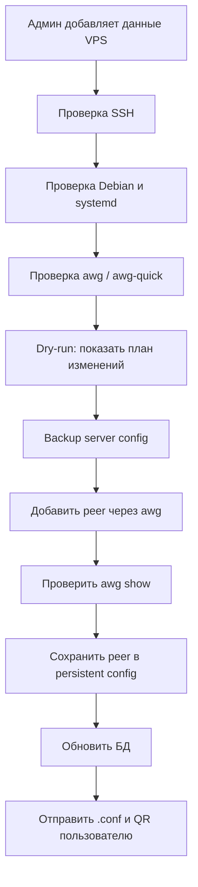
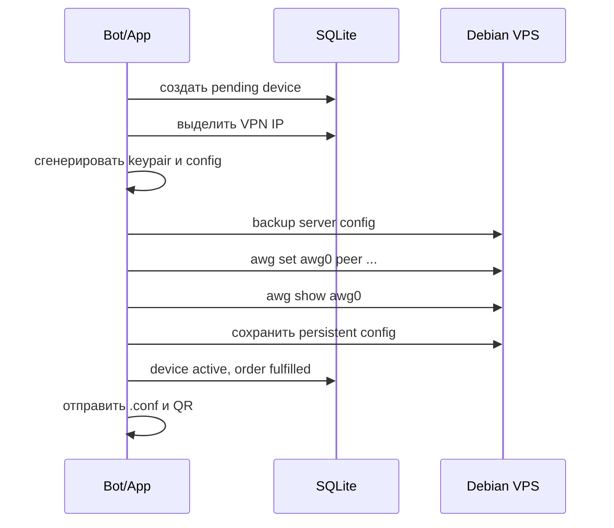

# Следующий этап: подключение реального VPS

Эта инструкция объясняет, что делать после локального каркаса Amneziya. Цель этапа - безопасно подключить реальный Debian VPS, научиться проверять сервер, делать backup и только потом добавлять VPN-peer.

Инструкция написана для новичка. Если какой-то шаг непонятен, лучше остановиться и уточнить, чем продолжать наугад.

## Простыми словами

Сейчас проект умеет локально:

- хранить пользователей, заявки и устройства;
- генерировать VPN-конфиг;
- шифровать секреты;
- делать backup и restore базы;
- иметь минимальный Telegram-бот.

Следующий этап - научить проект работать с настоящим VPS:

1. Подключиться к серверу по SSH.
2. Проверить, что сервер подходит.
3. Установить или проверить AmneziaWG.
4. Сделать backup серверного VPN-конфига.
5. Добавить peer на сервер.
6. Проверить, что peer реально появился.
7. Только после этого выдавать пользователю рабочий `.conf`.

## Главный принцип безопасности

Нельзя сразу менять живой сервер.

Сначала:

1. Проверка.
2. Dry-run.
3. Backup.
4. Изменение.
5. Проверка результата.
6. Только потом запись успешного статуса в базу.

Если любой шаг не прошел - остановиться.

## Общая схема



## Что понадобится

### На твоем компьютере

- Проект Amneziya.
- Python 3.12+.
- Доступ к Telegram bot token.
- `APP_SECRET_KEY`, который нельзя терять.
- SSH private key или пароль от VPS.

### Если у тебя Windows 10 или Windows 11

Открой **PowerShell**. Проще всего:

1. Нажми `Win`.
2. Напиши `PowerShell`.
3. Открой обычный PowerShell.
4. Команды ниже можно копировать и вставлять.

#### 1. Проект Amneziya

Если проект уже лежит в папке:

```powershell
cd C:\Users\SooL\Documents\Amneziya
```

Проверить, что ты в правильной папке:

```powershell
dir
```

Ты должен увидеть примерно:

```text
README.md
docs
app
tests
pyproject.toml
```

Если папка другая, замени путь в команде `cd` на свой.

#### 2. Python 3.12+

Официальные ссылки:

- Python downloads: <https://www.python.org/downloads/windows/>
- Документация Python для Windows: <https://docs.python.org/3/using/windows.html>

Самый простой способ установки через PowerShell:

```powershell
winget install Python.Python.3.12
```

После установки закрой PowerShell, открой заново и проверь:

```powershell
python --version
```

Ожидаемый результат:

```text
Python 3.12.x
```

Если команда `python` не найдена, попробуй:

```powershell
py --version
```

Установить зависимости проекта:

```powershell
python -m pip install -e .[dev]
```

Проверить проект:

```powershell
python -m pytest tests -v
```

Если видишь `passed`, значит локальная часть работает.

#### 3. Telegram bot token

Официальная документация Telegram Bots:

- <https://core.telegram.org/bots>
- BotFather: <https://t.me/BotFather>

Как получить token:

1. Открой Telegram.
2. Перейди в <https://t.me/BotFather>.
3. Нажми `Start`.
4. Отправь команду:

```text
/newbot
```

5. BotFather попросит имя бота. Например:

```text
Amneziya Test Bot
```

6. Потом попросит username. Он должен заканчиваться на `bot`. Например:

```text
my_amneziya_test_bot
```

7. BotFather выдаст token вида:

```text
1234567890:AAExampleExampleExampleExample
```

Этот token нужно вставить в `.env`:

```env
TELEGRAM_BOT_TOKEN=CHANGE_ME_TOKEN_FROM_BOTFATHER
```

Важно: token нельзя отправлять другим людям и нельзя коммитить в git.

#### 4. `APP_SECRET_KEY`

`APP_SECRET_KEY` шифрует VPN private keys и PSK в базе. Его нельзя терять.

Сгенерировать секрет в PowerShell:

```powershell
python -c "import secrets; print(secrets.token_urlsafe(48))"
```

Пример результата:

```text
CHANGE_ME_GENERATED_RANDOM_SECRET_48_PLUS_CHARS
```

Вставить в `.env`:

```env
APP_SECRET_KEY=CHANGE_ME_GENERATED_RANDOM_SECRET_48_PLUS_CHARS
```

Сохрани этот ключ отдельно в надежном месте. Если потерять `APP_SECRET_KEY`, backup базы можно будет восстановить как файл, но сохраненные VPN-секреты расшифровать не получится.

#### 5. SSH private key или пароль от VPS

Официальная документация Microsoft по OpenSSH:

- OpenSSH overview: <https://learn.microsoft.com/windows-server/administration/OpenSSH/openssh-overview>
- Установка и первый запуск OpenSSH: <https://learn.microsoft.com/windows-server/administration/openssh/openssh_install_firstuse>

Проверить, есть ли SSH в Windows:

```powershell
ssh -V
```

Если команда показывает версию OpenSSH, всё хорошо.

Если SSH не найден, установить OpenSSH Client:

```powershell
Add-WindowsCapability -Online -Name OpenSSH.Client~~~~0.0.1.0
```

Проверить снова:

```powershell
ssh -V
```

Создать SSH key:

```powershell
ssh-keygen -t ed25519 -f $env:USERPROFILE\.ssh\id_ed25519
```

PowerShell спросит passphrase. Можно задать пароль для ключа или нажать `Enter`, чтобы оставить пустым. Для новичка проще пустой passphrase, но безопаснее - с passphrase.

После генерации появятся два файла:

```text
C:\Users\<твой_пользователь>\.ssh\id_ed25519
C:\Users\<твой_пользователь>\.ssh\id_ed25519.pub
```

Важно:

- `id_ed25519` - private key, никому не отправлять;
- `id_ed25519.pub` - public key, его можно добавлять на VPS.

Проверить подключение к VPS:

```powershell
ssh root@YOUR_SERVER_IP
```

Если используется другой пользователь:

```powershell
ssh username@YOUR_SERVER_IP
```

Если используется ключ явно:

```powershell
ssh -i $env:USERPROFILE\.ssh\id_ed25519 root@YOUR_SERVER_IP
```

Если подключение успешно, сервер покажет Linux-консоль. Выйти:

```bash
exit
```

#### 6. Минимальный `.env` для Windows

Открой файл `.env` в Блокноте:

```powershell
notepad .env
```

Минимальный пример:

```env
TELEGRAM_BOT_TOKEN=CHANGE_ME_TOKEN_FROM_BOTFATHER
APP_SECRET_KEY=CHANGE_ME_GENERATED_RANDOM_SECRET
ADMIN_TELEGRAM_IDS=123456789
DATABASE_PATH=data/amneziya.sqlite3
ACCESS_MODE=free_test
FREE_TEST_REQUIRES_APPROVAL=true
DEFAULT_PLAN_DAYS=7
MAX_DEVICES_PER_USER=5
CLIENT_DNS=1.1.1.1
CLIENT_ALLOWED_IPS=0.0.0.0/0
EXPIRATION_NOTICE_DAYS=7,5,3,1
VPN_PORT_MIN=30001
VPN_PORT_MAX=65535
VPN_SERVER_RUNTIME=host_systemd
DEFAULT_VPN_NETWORK_CIDR=10.8.0.0/24
```

Проверить, что проект запускает тесты:

```powershell
python -m pytest tests -v
```

Запустить бота:

```powershell
python -m app.main
```

Если token правильный, бот начнет polling. Остановить:

```text
Ctrl+C
```

### На VPS

- Debian.
- SSH-доступ.
- Пользователь с правами для установки пакетов и настройки сети.
- Открытый UDP-порт для VPN.
- `ufw`, если firewall будет управляться через него.

## Важные секреты

Никогда не отправляй в чат и не коммить:

- Telegram bot token;
- `APP_SECRET_KEY`;
- SSH private key;
- настоящие `.conf`;
- QR-коды VPN;
- реальный `servers.yml`;
- backup-архивы.

Эти файлы должны оставаться локальными:

```text
.env
servers.yml
*.sqlite3
*.conf
*.qr.png
backups/
```

## Шаг 1. Создать `.env`

Скопировать пример:

```powershell
Copy-Item .env.example .env
```

Заполнить:

```env
TELEGRAM_BOT_TOKEN=CHANGE_ME_TOKEN_FROM_BOTFATHER
APP_SECRET_KEY=CHANGE_ME_GENERATED_RANDOM_SECRET_32_PLUS_CHARS
ADMIN_TELEGRAM_IDS=твой_telegram_id
DATABASE_PATH=data/amneziya.sqlite3
```

Важно: `APP_SECRET_KEY` нужен для расшифровки peer-секретов. Если его потерять, восстановить сохраненные private keys будет нельзя.

## Шаг 2. Создать `servers.yml`

Файл `servers.yml` не должен попадать в git.

Пример:

```yaml
servers:
  - name: "debian-vps-1"
    enabled: true
    location: "default"

    ssh:
      host: "YOUR_SERVER_IP"
      port: 22
      user: "root"
      auth:
        type: "key"
        private_key_path: "C:/Users/you/.ssh/id_ed25519"

    vpn:
      endpoint_host: "YOUR_SERVER_IP"
      port: "auto"
      port_min: 30001
      port_max: 65535
      interface: "awg0"
      network_cidr: "10.8.0.0/24"
      server_address: "10.8.0.1/24"
      dns: "1.1.1.1"
      allowed_ips: "0.0.0.0/0"
      max_devices: 254

    firewall:
      provider: "ufw"
      open_vpn_port: true

    runtime:
      type: "host_systemd"
      service_name: "awg-quick@awg0"
```

## Шаг 3. Проверить локальные тесты

Перед работой с VPS локальный проект должен быть зеленым:

```powershell
python -m pytest tests -v
```

Ожидаемый результат:

```text
passed
```

Если тесты падают - не идти дальше.

## Шаг 4. Сделать backup локальной базы

Если база уже есть:

```powershell
python -m app.cli backup create --db data/amneziya.sqlite3 --output backups
```

Проверить backup:

```powershell
python -m app.cli backup verify --file backups/<backup-file>.tar.enc
```

Пробный restore в другой файл:

```powershell
python -m app.cli backup restore --file backups/<backup-file>.tar.enc --target-db data/restore-check.sqlite3
```

Если restore не проходит - не работать с сервером.

## Шаг 5. Проверить команду `server check`

На этом шаге проект уже умеет читать `servers.yml`, выбирать нужный VPS и готовить безопасный `server check`.

Команда:

```powershell
python -m app.cli server check --config servers.yml --server debian-vps-1
```

Важно: этот этап проектируется как read-only. Команда проверки должна только читать состояние VPS и не должна устанавливать пакеты, менять firewall, запускать службы или записывать файлы.

В текущем каркасе CLI уже принимает эту команду и проверяет конфиг. Реальное SSH-подключение будет подключаться отдельным следующим шагом, чтобы не смешивать безопасную проверку и изменение сервера.

Проверки:

- SSH доступен;
- ОС - Debian;
- есть `systemd`;
- есть `ufw` или понятно, что firewall другой;
- есть `awg` и `awg-quick`, либо их нужно установить;
- выбранный UDP-порт виден в списке UDP-сокетов;
- IP forwarding можно включить;
- VPN CIDR не конфликтует с уже занятыми адресами.

## Шаг 6. Реализовать dry-run

Dry-run показывает, что будет сделано.

Пример вывода:

```text
Server: debian-vps-1
OS: Debian
VPN interface: awg0
VPN port: 43125
Firewall: ufw

Planned actions:
- install AmneziaWG packages if missing
- enable IP forwarding
- open UDP port 43125
- create awg0 config if missing
- enable systemd service awg-quick@awg0

No changes were applied.
```

Команда будущего вида:

```powershell
python -m app.cli server plan --config servers.yml --server debian-vps-1
```

## Шаг 7. Backup server config перед изменениями

Перед любым изменением server manager должен делать backup:

- `/etc/amnezia/amneziawg/awg0.conf`, если такой путь используется;
- или фактического persistent config пути;
- metadata: дата, сервер, интерфейс, checksum.

Backup должен быть зашифрован или храниться в защищенном месте.

Правило:

```text
Нет backup - нет изменения сервера.
```

## Шаг 8. Добавить peer на сервер

Только после check, dry-run и backup можно добавлять peer.

Схема:



Если `awg set` не прошел:

- device остается `pending` или `failed`;
- IP можно освободить;
- пользователь не получает нерабочий конфиг.

## Шаг 9. Проверить peer

После добавления peer нужно проверить:

```bash
awg show awg0
```

Нужно увидеть public key нового peer.

Также проверить:

```bash
systemctl status awg-quick@awg0
```

И firewall:

```bash
ufw status
```

## Шаг 10. Выдать пользователю конфиг

Пользователь получает:

- `.conf`;
- QR;
- краткую инструкцию;
- дату окончания доступа.

Важно: если серверная часть не подтвердила peer, конфиг пользователю не отправлять.

## Что делать при ошибке

### Ошибка SSH

Проверить:

- IP сервера;
- порт SSH;
- username;
- private key path;
- доступен ли сервер.

### Ошибка установки AmneziaWG

Остановиться и сохранить лог ошибки без секретов.

### Ошибка добавления peer

Откатить локальное состояние:

- не делать device `active`;
- не делать order `fulfilled`;
- сохранить admin action с ошибкой без секретов;
- не отправлять конфиг пользователю.

### Потерян bot-сервер, но VPN VPS жив

1. Поднять проект на новом хосте.
2. Положить `.env` с тем же `APP_SECRET_KEY`.
3. Восстановить backup базы.
4. Проверить restore.
5. Запустить бота.

Клиенты при этом должны продолжить работать, потому что VPN-сервер не менялся.

### Потерян VPN VPS

Если нельзя восстановить тот же endpoint и серверные ключи, бесшовно сохранить старые подключения невозможно.

План:

1. Поднять новый VPS.
2. Восстановить приложение.
3. Пометить старые devices как требующие перевыпуска.
4. Выпустить новые конфиги.
5. Отправить пользователям новые `.conf` и QR.

## Что считать завершением этапа

Этап можно считать завершенным, если:

- server check работает без изменений сервера;
- dry-run показывает понятный план;
- server config backup создается перед изменениями;
- peer добавляется на VPS;
- `awg show` подтверждает peer;
- `.conf` подключается в клиенте;
- restore базы проверен;
- ошибка на любом шаге не оставляет “полуактивный” доступ.

## Рекомендуемый порядок разработки

1. `server check`
2. `server plan`
3. `server backup`
4. `server apply peer`
5. `server revoke peer`
6. reconcile БД с `awg show`
7. Telegram admin approve с реальным VPS

Платежи лучше подключать после этого этапа.
