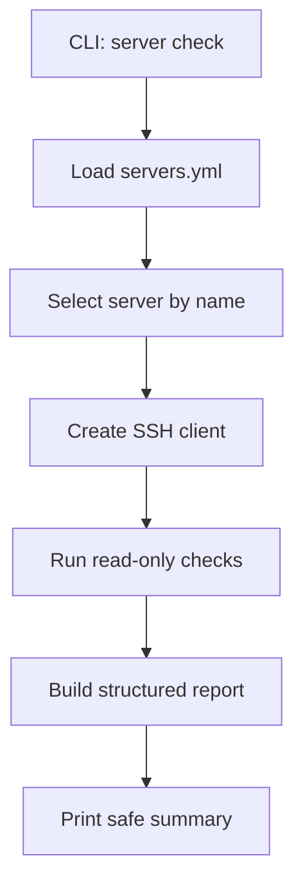

# Server Check Design

## Goal

Add the first safe VPS integration step: `server check`.

This command reads `servers.yml`, selects one configured VPS, connects over SSH, and runs read-only checks that help decide whether the server is ready for AmneziaWG management.

The command must not modify the VPS.

## Scope

Included:

- Parse and validate `servers.yml`.
- Select a server by name.
- Represent SSH connection settings without logging secrets.
- Provide an SSH client abstraction that can be tested without a real VPS.
- Run read-only checks:
  - SSH connectivity;
  - OS release information;
  - Debian detection;
  - systemd availability;
  - `awg` availability;
  - `awg-quick` availability;
  - `ufw` availability;
  - VPN interface status, if present;
  - UDP port visibility check command construction.
- Return a structured report with `ok`, `warning`, and `error` checks.
- Add CLI command:

```powershell
python -m app.cli server check --config servers.yml --server debian-vps-1
```

Excluded:

- Installing packages.
- Enabling IP forwarding.
- Opening firewall ports.
- Creating or editing AmneziaWG config.
- Adding or revoking peers.
- Writing anything to the VPS.
- Uploading files.
- Asking interactive questions.

## Architecture

Add focused modules:

```text
app/server_config/
  models.py
  loader.py
app/server/
  checks.py
  report.py
  ssh.py
```

`server_config.models` contains dataclasses for server config.

`server_config.loader` reads YAML and validates required fields.

`server.ssh` defines a protocol-like SSH client interface. The first implementation can be a local abstraction with a fake client for tests; a real SSH backend can be added after the check logic is tested.

`server.checks` owns read-only check orchestration.

`server.report` owns structured check results and safe output formatting.

`app.cli` gets a `server check` subcommand.

## Data Flow



## Check Result Model

Each check returns:

- `name`;
- `status`: `ok`, `warning`, or `error`;
- `message`;
- optional `details`.

No detail may include:

- SSH password;
- private key contents;
- Telegram bot token;
- `APP_SECRET_KEY`;
- full VPN config;
- generated peer secrets.

## Read-Only Command Policy

Allowed commands for this stage:

```bash
cat /etc/os-release
command -v systemctl
command -v awg
command -v awg-quick
command -v ufw
systemctl is-active awg-quick@awg0
ss -lun
```

Commands must not include:

- `apt`;
- `install`;
- `systemctl enable`;
- `systemctl start`;
- `ufw allow`;
- file redirection;
- `rm`;
- `mv`;
- `sed -i`;
- any command that changes system state.

## Error Handling

If config is missing or invalid, fail before SSH.

If the selected server does not exist, fail with a clear error listing available server names.

If SSH fails, return a report with SSH check `error` and skip remote checks.

If a command fails, mark that specific check `warning` or `error` based on importance:

- Debian and SSH connectivity: `error`;
- `awg`, `awg-quick`, `ufw`: `warning` for this stage because installation belongs to a later stage;
- systemd missing: `error`;
- interface inactive: `warning` if AmneziaWG is not installed yet.

## Testing

Tests should cover:

- valid `servers.yml` parsing;
- missing server selection error;
- placeholder values rejected;
- server summary redacts private key paths only where needed;
- fake SSH client returns Debian/systemd/awg check success;
- SSH failure skips remote checks safely;
- command allowlist rejects mutating commands;
- CLI parser accepts `server check --config ... --server ...`.

No test should require a real VPS.

## Implementation Order

1. Config model and loader with tests.
2. Check result/report model with tests.
3. Read-only command policy with tests.
4. Fake SSH check runner with tests.
5. CLI integration with tests.
6. Documentation update in the beginner guide.

## Non-Goals

- Real provisioning.
- Real peer application.
- Real SSH dependency decisions beyond the interface.
- Payment integration.
- Telegram admin UI changes.
