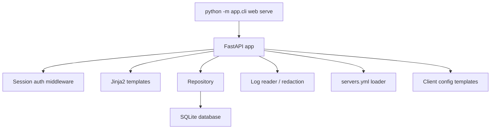

# Web Admin Panel Design

## Goal

Add a local Amneziya web admin panel on port `3030` so an administrator can visually manage users, servers, and diagnostics without relying on the Telegram interface. The panel should fit the first live VPS rollout: simple operations, minimal frontend deployment complexity, safe authentication, and useful logging.

## Context

Administration currently happens through the Telegram bot and CLI. The database already contains the main entities: `users`, `servers`, `devices`, `orders`, `admin_actions`, `device_traffic_snapshots`, and `message_templates`. Settings are loaded from `.env` through `app.config.Settings`. The VPS flow already has `server check`, `apply-peer`, `revoke-peer`, `collect-traffic`, and `bot check-network`.

## Recommended Approach

Use `FastAPI + Jinja2 + Uvicorn` inside the existing Python project.

Reasons:

- one runtime and one dependency stack with the current application;
- no Node.js build step on the VPS;
- server-rendered UI is enough for CRUD, logs, and diagnostic screens;
- easy reuse of the existing `Repository`, `Settings`, redaction, and services.

A React/Vue SPA is not needed yet: it would complicate deployment and authentication, while the first stage needs a reliable admin surface.

## New `.env` Settings

```env
WEB_ADMIN_ENABLED=true
WEB_ADMIN_HOST=0.0.0.0
WEB_ADMIN_PORT=3030
WEB_ADMIN_USERNAME=admin
WEB_ADMIN_PASSWORD_HASH=replace-with-password-hash
WEB_ADMIN_SESSION_SECRET=replace-with-generated-random-secret-32-plus-chars
APP_LOG_ENABLED=true
APP_LOG_LEVEL=INFO
APP_LOG_MAX_LINES=500
APP_LOG_PATH=logs/app.log
CLIENT_CONFIG_TEMPLATE_DIR=config_templates
```

`WEB_ADMIN_PASSWORD_HASH` stores a password hash, not the raw password. If the hash is empty or a placeholder, the web panel must refuse to start with an actionable error. `WEB_ADMIN_SESSION_SECRET` is used for signed session cookies and must be stored separately with `.env`.

`APP_LOG_ENABLED=false` disables application log file writing. `APP_LOG_LEVEL` supports `DEBUG`, `INFO`, `WARNING`, and `ERROR`. `APP_LOG_MAX_LINES` controls UI viewing depth, not infinite retention. File rotation can be simple: a Python logging rotating handler with a size limit.

`CLIENT_CONFIG_TEMPLATE_DIR` points to an external directory with editable client config templates. If the directory is empty or unset, package defaults are used. On a VPS, local templates should live outside the package directory so `git pull` does not overwrite manual edits.

## Architecture



The panel runs as a separate process from the Telegram bot:

```bash
python -m app.cli web serve --host 0.0.0.0 --port 3030
```

CLI flags may override `.env`, but defaults come from `Settings`.

## Authentication

The panel uses a `/login` form:

- username is compared with `WEB_ADMIN_USERNAME`;
- password is checked against `WEB_ADMIN_PASSWORD_HASH`;
- on success, a signed session cookie is set;
- `/logout` clears the session;
- every page except `/login` and the health endpoint requires authentication.

For the first stage, one web-admin account from `.env` is enough. Telegram-admin roles do not grant automatic web access.

## UI and Pages

The panel should be an operational workspace, not a landing page:

- `/` Dashboard: database status, user count, active devices, pending orders, servers, recent errors.
- `/users`: user table with search by Telegram ID, username, and name; create, edit, block, soft-delete actions.
- `/users/new`: create user by Telegram ID, username, first/last name, admin flag.
- `/users/{id}`: user profile, status, admin flag, devices, orders, recent admin actions.
- `/servers`: all-server table from DB and related config; manual status, live state, ping/latency, SSH reachability, endpoint, VPN port, device count, last check time.
- `/servers/new`: create server DB record; secrets are not entered or shown.
- `/servers/{id}`: edit host, SSH port, endpoint host, VPN port, network CIDR, server address, server public key, runtime, firewall, status, max devices.
- `/servers/{id}/health`: live diagnostics page for one server: ping/latency, TCP/SSH reachability, read-only `server check`, `awg-quick` state, UDP port visibility, latest error.
- `/orders`: pending/fulfilled/rejected orders for Telegram flow debugging.
- `/config-templates`: editable delivery templates and client `.conf` templates, placeholder list, rendered preview, and `vpn://` link preview without logging secrets.
- `/logs`: show last `APP_LOG_MAX_LINES`, filter by level, and plain-text search.
- `/settings`: read-only runtime settings with secret redaction.

Deletion must be safe in the first stage:

- user: `status='deleted'` or `status='blocked'`, without physically deleting rows;
- server: `status='disabled'`, without physical deletion if linked devices exist;
- physical deletion can be added later after a separate backup/restore scenario.

## User Management

Minimum actions:

- show all existing users from the current `users` table, including users previously created through the Telegram bot;
- create user;
- edit `telegram_id`, `username`, `first_name`, `last_name`, `status`, `is_admin`;
- block user;
- mark user as deleted;
- view active/total devices;
- view recent admin actions.

Changes should be recorded in `admin_actions` with actions such as `web_user_create`, `web_user_update`, `web_user_block`, and `web_user_delete`.

The web panel does not create a separate users table. The source of truth is the existing `users` table; linked `devices`, `orders`, and `admin_actions` must appear for already-created users without migration or manual import.

## Server Management

Minimum actions:

- create server DB record;
- edit main server fields;
- disable server;
- view device count and basic configuration;
- see live state for every server;
- manually run a health check for one server;
- refresh health checks for all servers.

The panel must not store SSH private keys, passwords, or PSKs. In the first stage it manages the server DB record; `servers.yml` remains the runtime config for SSH/VPS operations. If DB fields and `servers.yml` disagree, the UI should show a warning on the server page.

Live server state must be stored separately from the manual `servers.status`. Add a `server_health_checks` table or equivalent repository layer with:

- `server_id`;
- `status`: `online`, `degraded`, `offline`, `unknown`;
- `latency_ms`;
- `ssh_ok`;
- `awg_ok`;
- `udp_port_ok`;
- `checked_at`;
- `error`.

In the UI, `ping` means a fast reachability check. For the MVP, TCP connect to the SSH port with a timeout is acceptable, and the full read-only `server check` can run from a button/refresh action. ICMP ping is not required because it is often disabled by VPS/firewall policy.

## Client Config Templates And Delivery

The code already includes these user delivery paths:

- Telegram message rendered from the `config_ready` template;
- attached `.conf` file;
- QR PNG generated from the rendered config text;
- user-triggered resend from the devices section;
- admin-triggered resend from the Telegram admin interface;
- emergency fallback: if file/QR delivery fails after device creation, the bot sends the message text and raw config text as separate messages.

The web-panel work adds a separate client config template layer:

- default `amneziawg_v1_5.conf.tpl` and `amneziawg_v2.conf.tpl` files live in the package;
- local VPS templates may live in `CLIENT_CONFIG_TEMPLATE_DIR` and override defaults;
- templates contain stable config lines such as `[Interface]`, `[Peer]`, `DNS`, `AllowedIPs`, `PersistentKeepalive`, AmneziaWG obfuscation fields, and placeholders for variable values;
- variable values come from the current flow: `private_key`, `address`, `server_public_key`, `preshared_key`, `endpoint`, `device_id`, `config_version`, server parameters, and the selected config version;
- unknown placeholders must not disappear silently: preview and tests should report an error so a broken config is not sent to a user;
- the web panel shows the current template, source (`default` or `override`), available placeholders, and a preview rendered with test data;
- UI writes are allowed only to the external `CLIENT_CONFIG_TEMPLATE_DIR`; package defaults stay read-only.

Users also get an import link in the form `vpn://...`. The MVP link format is isolated in `build_vpn_import_link(config_text)` so the payload can be changed in one place after testing with a real AmneziaVPN client. The first payload format is URL-safe Base64 of the final UTF-8 `.conf` text after the `vpn://` prefix. The link is shown:

- in the Telegram message through `{vpn_link}`;
- on the web device detail page;
- in the `/config-templates` preview;
- as QR payload after real-client confirmation; until then, the `.conf` file remains the canonical delivery method.

## Logging

Add centralized logging configuration:

- console logs remain available for systemd;
- when `APP_LOG_ENABLED=true`, write to `APP_LOG_PATH`;
- level comes from `APP_LOG_LEVEL`;
- secrets pass through `redact()` before file logging;
- web `/logs` shows only the last `APP_LOG_MAX_LINES`.

Useful debug events for Telegram/admin operations:

- application startup;
- successful and failed web login without logging the password;
- user create/update;
- server create/update;
- server health check success/failure;
- handler errors;
- Telegram network check;
- VPS apply/revoke/traffic commands and their result without secrets.

## Errors and Security

- All forms use POST with a CSRF token or a session-bound nonce.
- UI errors show a short message; details go to logs.
- Secrets are not shown in UI and are not written to logs.
- Password hash and session secret are validated at startup.
- The web panel is intended to run behind a firewall/VPN/reverse proxy. Publicly exposing port `3030` without network restrictions is not recommended.

## Testing

Cover with tests:

- Settings reads web/logging parameters;
- login success/failure;
- protected route redirects without session;
- users list/create/update/block/delete;
- servers list/create/update/disable;
- server health check stores online/degraded/offline state and exposes it in UI;
- logs viewer applies `APP_LOG_MAX_LINES` and redaction;
- client config templates render current AmneziaWG configs, expose placeholders, and show `vpn://` import links;
- CLI accepts `web serve`;
- startup refuses empty password hash.

## MVP Acceptance Criteria

- `python -m app.cli web serve --host 0.0.0.0 --port 3030` starts the web panel.
- `/login` accepts a valid username/password and protects the remaining pages.
- Users previously created through the Telegram bot appear in `/users` and detail pages with their devices and orders.
- Users can be added, edited, blocked, and marked as deleted.
- Servers can be added, edited, and disabled.
- Every server is shown with live state: online/degraded/offline/unknown, latency, last check time, and latest error.
- `/config-templates` shows the message template, `.conf` templates per version, preview, available placeholders, and a `vpn://` link.
- Users can receive configs through Telegram text, `.conf` file, QR, resend flows, and a `vpn://` link; the emergency fallback still preserves raw config text delivery.
- `/logs` shows recent log lines with redaction.
- `APP_LOG_ENABLED`, `APP_LOG_LEVEL`, `APP_LOG_MAX_LINES`, and `APP_LOG_PATH` control logging.
- All new behavior tests pass with the existing test suite.

## Out of Scope for MVP

- separate roles and multiple web-admin accounts;
- React/Vue SPA;
- public user registration;
- physical deletion of linked production records;
- editing SSH private keys and secrets through UI;
- automatic VPS provisioning from the web panel.
