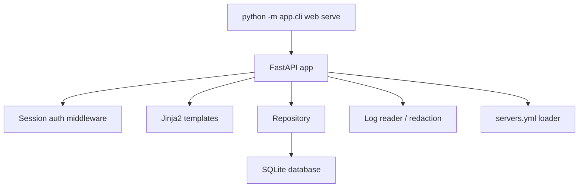

# Web Admin Panel Design

## Цель

Добавить локальную web-панель управления Amneziya на порту `3030`, чтобы администратор мог визуально управлять пользователями, серверами и диагностикой без Telegram-интерфейса. Панель должна быть пригодна для первого VPS-запуска: простая эксплуатация, минимальная зависимость от frontend-сборки, безопасная авторизация и понятное логирование.

## Контекст

Сейчас управление идет через Telegram bot и CLI. База данных уже содержит основные сущности: `users`, `servers`, `devices`, `orders`, `admin_actions`, `device_traffic_snapshots`, `message_templates`. Настройки читаются из `.env` через `app.config.Settings`. Для VPS уже есть `server check`, `apply-peer`, `revoke-peer`, `collect-traffic` и `bot check-network`.

## Рекомендуемый подход

Использовать `FastAPI + Jinja2 + Uvicorn` внутри существующего Python-проекта.

Причины:

- один runtime и один dependency stack с текущим приложением;
- нет Node.js build step на VPS;
- server-rendered UI достаточно для CRUD, логов и диагностических экранов;
- легко переиспользовать существующие `Repository`, `Settings`, redaction и сервисы.

React/Vue SPA пока не нужен: он усложнит деплой и авторизацию, а ценность на первом этапе даст именно надежная админская поверхность.

## Новые настройки `.env`

```env
WEB_ADMIN_ENABLED=true
WEB_ADMIN_HOST=0.0.0.0
WEB_ADMIN_PORT=3030
WEB_ADMIN_USERNAME=admin
WEB_ADMIN_PASSWORD_HASH=replace-with-password-hash
WEB_ADMIN_SESSION_SECRET=replace-with-generated-random-secret-32-plus-chars
APP_LOG_ENABLED=true
APP_LOG_LEVEL=INFO
APP_LOG_MAX_LINES=500
APP_LOG_PATH=logs/app.log
```

`WEB_ADMIN_PASSWORD_HASH` хранит hash пароля, не исходный пароль. Если hash пустой или placeholder, web-панель должна отказаться стартовать и вывести понятную ошибку. `WEB_ADMIN_SESSION_SECRET` используется для signed session cookie и должен храниться отдельно вместе с `.env`.

`APP_LOG_ENABLED=false` отключает запись application log. `APP_LOG_LEVEL` поддерживает `DEBUG`, `INFO`, `WARNING`, `ERROR`. `APP_LOG_MAX_LINES` задает глубину просмотра в UI, а не бесконечное хранение. Ротация файла может быть простой: ограничение размера через Python logging rotating handler.

## Архитектура



Панель запускается отдельным процессом от Telegram bot:

```bash
python -m app.cli web serve --host 0.0.0.0 --port 3030
```

Флаги CLI могут переопределять `.env`, но defaults берутся из `Settings`.

## Авторизация

Панель использует форму входа `/login`:

- username сравнивается с `WEB_ADMIN_USERNAME`;
- password проверяется против `WEB_ADMIN_PASSWORD_HASH`;
- при успехе выставляется signed session cookie;
- `/logout` удаляет сессию;
- все страницы, кроме `/login` и health endpoint, требуют авторизации.

На первом этапе достаточно одного web-admin аккаунта из `.env`. Telegram-admin роли не дают автоматический web-доступ.

## UI и страницы

Панель должна быть рабочей поверхностью, не landing page:

- `/` Dashboard: состояние БД, количество пользователей, активных устройств, pending orders, серверов, последние ошибки.
- `/users`: таблица пользователей с поиском по Telegram ID, username, имени; действия добавления, редактирования, блокировки, soft-delete.
- `/users/new`: создание пользователя по Telegram ID, username, first/last name, admin flag.
- `/users/{id}`: карточка пользователя, статус, admin flag, устройства, заявки, последние admin actions.
- `/servers`: таблица серверов из БД и связанной конфигурации; status, host, endpoint, VPN port, devices count.
- `/servers/new`: добавление серверной записи в БД; секреты не вводятся и не показываются.
- `/servers/{id}`: редактирование host, ssh port, endpoint host, vpn port, network CIDR, server address, server public key, runtime, firewall, status, max devices.
- `/orders`: pending/fulfilled/rejected заявки для дебага Telegram flow.
- `/logs`: просмотр последних `APP_LOG_MAX_LINES`, фильтр по уровню и plain-text поиск.
- `/settings`: read-only страница ключевых runtime-настроек с redaction секретов.

Удаление пользователей и серверов на первом этапе должно быть безопасным:

- пользователь: `status='deleted'` или `status='blocked'`, без физического удаления строк;
- сервер: `status='disabled'`, без физического удаления, если есть связанные устройства;
- физическое удаление можно добавить позже после отдельного backup/restore сценария.

## Управление пользователями

Минимальные действия:

- создать пользователя;
- редактировать `telegram_id`, `username`, `first_name`, `last_name`, `status`, `is_admin`;
- заблокировать пользователя;
- пометить пользователя удаленным;
- посмотреть active/total devices;
- посмотреть последние admin actions.

Изменения должны записываться в `admin_actions` с action вроде `web_user_create`, `web_user_update`, `web_user_block`, `web_user_delete`.

## Управление серверами

Минимальные действия:

- создать серверную запись в БД;
- редактировать основные поля сервера;
- отключить сервер;
- посмотреть количество устройств и базовую конфигурацию.

Панель не должна хранить SSH private key, пароли или PSK. На первом этапе она управляет серверной записью в БД; `servers.yml` остается runtime-конфигом для SSH/VPS операций. Если поле в БД и `servers.yml` расходятся, UI должен показывать предупреждение на странице сервера.

## Логирование

Нужно добавить централизованную настройку logging:

- консольные логи остаются для systemd;
- при `APP_LOG_ENABLED=true` пишется `APP_LOG_PATH`;
- уровень берется из `APP_LOG_LEVEL`;
- секреты перед записью проходят через `redact()`;
- web `/logs` показывает только последние `APP_LOG_MAX_LINES`.

Для дебага Telegram/админки полезны события:

- старт приложения;
- успешная/неуспешная web-авторизация без пароля в логе;
- создание/изменение пользователя;
- создание/изменение сервера;
- ошибки handlers;
- network check Telegram;
- VPS apply/revoke/traffic commands и их результат без секретов.

## Ошибки и безопасность

- Все формы используют POST с CSRF token или session-bound nonce.
- Ошибки UI показывают короткое сообщение; подробности идут в лог.
- Секреты не показываются в UI и не пишутся в лог.
- Password hash и session secret проверяются при старте.
- Web-панель должна быть рассчитана на запуск за firewall/VPN/reverse proxy. Публичное выставление порта `3030` без сетевого ограничения не рекомендуется.

## Тестирование

Покрыть тестами:

- Settings читает web/logging параметры;
- login success/failure;
- protected route redirect без session;
- users list/create/update/block/delete;
- servers list/create/update/disable;
- logs viewer применяет `APP_LOG_MAX_LINES` и redaction;
- CLI принимает `web serve`;
- startup отказывается стартовать при пустом password hash.

## Критерии приемки MVP

- `python -m app.cli web serve --host 0.0.0.0 --port 3030` запускает web-панель.
- `/login` принимает корректный логин/пароль и защищает остальные страницы.
- Пользователей можно добавить, отредактировать, заблокировать и пометить удаленными.
- Серверы можно добавить, отредактировать и отключить.
- `/logs` показывает последние строки логов с redaction.
- `APP_LOG_ENABLED`, `APP_LOG_LEVEL`, `APP_LOG_MAX_LINES`, `APP_LOG_PATH` управляют логированием.
- Все новые behavior-тесты проходят вместе с существующим набором.

## Не входит в MVP

- отдельные роли и multi-admin web accounts;
- React/Vue SPA;
- публичная регистрация пользователей;
- физическое удаление связанных production-записей;
- редактирование SSH private keys и секретов через UI;
- автоматическое provisioning VPS из web-панели.
