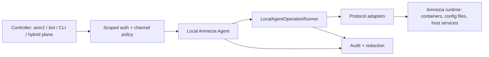

# Local Amnezia Agent для VPN Ops Lab / `amn2`: design spec

## Назначение

Этот документ фиксирует дизайн собственного server-side API agent для Amnezia runtime. Идея вдохновлена исследованием `kyoresuas/amnezia-api`, но код, route layout, install scripts, configs и тексты upstream не копируются.

Цель: превратить мысль "поставить API-скрипт на сервер Amnezia и управлять пользователями" в безопасную продуктовую архитектуру для `amn2` и будущего hybrid-режима.

Документ не является implementation plan. После review этого spec нужен отдельный план первого среза.

## Контекст

В текущей линии VPN Ops Lab уже есть несколько foundational specs:

- `RemoteOperationRunner`: безопасная модель remote operations, dry-run/apply, command policy, audit, redaction и recovery notes.
- `Route Policy Matrix`: обязательная policy-запись для каждого endpoint: auth, scopes, risk class, audit, rate limit, tests.
- `Scoped API Tokens`: hash-only tokens, one-time display, expiry, revoke, rotation, owner binding и explicit scopes.
- `Secret Inventory + Backup Policy`: secret classes, redacted/full backups, restore gates, no secret logs.
- `Public/Self-service Config Delivery`: `vpn://`, QR, `.conf` и protocol links как `secret-read`, с ownership и expiry.
- `amn2` remote operations inventory: текущая реальность `amn2`, где live apply выключен по умолчанию, есть dry-run/apply flags, но еще нет единого runner contract.

`kyoresuas/amnezia-api` показывает полезный product direction: API-agent рядом с Amnezia runtime, который умеет lifecycle клиентов, status, backup/import и protocol-specific operations. Но подход "ставим как есть" для нашего продукта слишком рискованный: single API key, privileged runtime access, sensitive backup state, destructive endpoints и слабая policy-модель.

## Product Principle

Local Amnezia Agent не должен быть отдельной админ-панелью. Это локальный runtime adapter, который живет рядом с Amnezia на VPS и выполняет строго ограниченные операции по запросу доверенного controller.

Controller может быть:

- `amn2` web/admin;
- Telegram bot/backend;
- CLI/admin tool;
- будущий hybrid control plane.

Agent отвечает за локальную правду о runtime. Controller отвечает за пользователей, права, продуктовый UX, billing/ownership, operator workflow и cross-server orchestration.

Главное правило: agent никогда не становится публичным "root API" к серверу.

## Что Берем Как Идею

Из `kyoresuas/amnezia-api` переносим только самостоятельно сформулированные идеи:

- server-installed API рядом с Amnezia runtime;
- единый client lifecycle surface для разных VPN protocols;
- protocol adapters вместо UI-driven/manual-only управления;
- health/status/load endpoints для controller;
- возможность получать клиентскую конфигурацию через API;
- мысль о backup/import как отдельной operational capability.

Не переносим:

- исходный код;
- структуру handlers/controllers/services;
- install script;
- Dockerfile/docker-compose runtime shape;
- тексты README/docs;
- exact route naming;
- небезопасную модель "один общий ключ на все";
- public HTTP/nginx exposure как default;
- reboot/import/full backup endpoints как раннюю production-функцию.

License verdict для upstream: `MIT`, compatible in principle. Transfer mode для нас: `idea-only`, потому что продуктовая цель - собственный качественный дизайн, а не derivative copy.

## Scope

In scope:

- границы Local Amnezia Agent;
- auth/channel модель;
- route policy для agent endpoints;
- operation/risk модель;
- secret/config handling;
- install/runtime hardening;
- backup/import policy;
- audit/metrics;
- test strategy;
- первый безопасный срез.

Out of scope:

- конкретный язык реализации;
- копирование upstream implementation;
- полноценная UI/admin panel;
- billing;
- Telegram UX;
- public SaaS control plane;
- OAuth/OIDC;
- production rollout на реальный VPS;
- full write lifecycle без отдельного implementation plan.

## Architecture Overview

Agent состоит из пяти логических частей:

- API boundary: routes, auth, request validation, response redaction.
- Policy layer: scopes, risk class, rate limit, audit requirement.
- LocalAgentOperationRunner: локальная версия runner contract, без raw shell strings из handlers.
- Runtime adapters: AmneziaWG, AmneziaWG 2.0, Xray и будущие protocols.
- Secret boundary: выдача configs/links/QR только через `secret-read` routes.

## Trust Boundaries

Agent работает внутри самого чувствительного trust boundary: рядом с Docker socket, Amnezia configs, protocol keys, peer state и host services.

Следствия:

- доступ к Docker socket считается host-equivalent privilege;
- central controller не должен напрямую получать Docker socket или shell;
- handlers не должны формировать произвольные shell-команды;
- secrets не должны попадать в logs, metrics, errors, audit body, backups по умолчанию;
- destructive operations требуют отдельного scope, operator intent и recovery note.

## Deployment Modes

### Phase 0: design only

Фиксируем архитектурные правила и переносим их в VPN Ops Lab knowledge base.

### Phase 1: read-only local agent

Agent доступен только локально, через private network или через controlled tunnel. Разрешены только:

- health;
- version/build info;
- runtime detection;
- protocol/container status;
- read-only capability discovery.

Нет выдачи client configs. Нет write операций. Нет backup/import/reboot.

### Phase 2: controlled write lifecycle

Добавляются state-write операции для user lifecycle:

- create client;
- disable/enable client;
- revoke/delete client;
- rotate config/keys where protocol supports it.

Каждая write operation проходит через plan/apply модель, audit и partial failure contract.

### Phase 3: hybrid multi-node

Controller выбирает server/agent, хранит ownership и policy, а agent исполняет локальные operations. Появляются server groups, capacity signals, health scoring и controlled failover.

### Rejected as default

- public HTTP API on port 80;
- nginx exposure без TLS и auth gateway;
- one shared global API key;
- unprotected `/docs` и `/metrics`;
- full backup endpoint как обычная функция;
- reboot/import endpoint в первом production slice;
- контейнер с Docker socket без отдельной threat model.

## Auth And Channel

Минимальная модель:

- bearer token хранится hash-only;
- raw token показывается один раз;
- token имеет owner/controller identity;
- token имеет expiry;
- token можно revoke/rotate;
- каждый route требует explicit scope;
- destructive scope не выдается вместе с read-only scope по умолчанию.

Начальные scopes:

| Scope | Назначение |
| --- | --- |
| `agent:health` | health/version/status без sensitive details |
| `agent:read` | read-only runtime discovery |
| `agent:protocols:read` | список protocols/capabilities/status |
| `agent:clients:read` | список клиентов без secrets |
| `agent:clients:write` | create/disable/enable/delete clients |
| `agent:configs:read` | выдача secret-bearing configs/links/QR |
| `agent:backup:read` | redacted backup/export |
| `agent:backup:full` | encrypted full backup with explicit confirmation |
| `agent:backup:restore` | import/restore, destructive |
| `agent:operations:destructive` | reboot/reset/import-like operations |

Channel policy:

- Phase 1: local bind/private network/tunnel only.
- Public exposure requires TLS, rate limit, route policy, logs redaction и operator review.
- `/docs` and `/metrics` are protected or local-only.

## Route Policy Draft

| Endpoint | Risk | Scope | Audit | First slice |
| --- | --- | --- | --- | --- |
| `GET /agent/health` | `read-only` | `agent:health` | optional aggregate | yes |
| `GET /agent/version` | `read-only` | `agent:health` | optional aggregate | yes |
| `GET /agent/runtime` | `read-only-runtime` | `agent:read` | yes | yes |
| `GET /agent/protocols` | `read-only-runtime` | `agent:protocols:read` | yes | yes |
| `GET /agent/clients` | `read-only` | `agent:clients:read` | yes | no |
| `POST /agent/clients` | `state-write` | `agent:clients:write` | required | no |
| `PATCH /agent/clients/{id}` | `state-write` | `agent:clients:write` | required | no |
| `DELETE /agent/clients/{id}` | `state-write` | `agent:clients:write` | required | no |
| `GET /agent/configs/{id}` | `secret-read` | `agent:configs:read` | required | no |
| `GET /agent/backup/redacted` | `secret-read` | `agent:backup:read` | required | no |
| `POST /agent/backup/full` | `secret-read` | `agent:backup:full` | required | no |
| `POST /agent/restore` | `destructive-local` | `agent:backup:restore` | required | no |
| `POST /agent/reboot` | `destructive-local` | `agent:operations:destructive` | required | no |

Любой новый route без policy record считается blocked.

## Operation Model

Agent operations делятся на классы:

- `read-only`: health/version/capabilities without runtime mutation.
- `read-only-runtime`: inspect containers/config presence/status without returning secrets.
- `telemetry`: aggregate metrics, no per-user sensitive details by default.
- `secret-read`: configs, QR, `vpn://`, Xray links, private keys, PSK-bearing payloads.
- `state-write`: user lifecycle changes.
- `local-runtime-write`: Docker/config/service changes.
- `destructive-local`: restore/import/reboot/reset.

State-changing operations require:

- validated command/action object, not raw shell string;
- policy record;
- plan output before apply where feasible;
- idempotency key or operation id;
- audit event;
- redaction pass;
- bounded timeout;
- partial failure result;
- recovery note.

## Runtime Adapter Contract

Каждый protocol adapter должен отвечать на одинаковые вопросы:

- `detect()`: protocol/runtime exists?
- `capabilities()`: list/create/disable/delete/config/export supported?
- `status()`: running/degraded/stopped/unknown.
- `listClients(redacted=true)`: без secret-bearing payloads by default.
- `planCreateClient(input)`: validate and describe changes.
- `applyCreateClient(plan)`: apply with operation result.
- `planRevokeClient(input)`: validate and describe changes.
- `applyRevokeClient(plan)`: apply with operation result.
- `getClientConfig(input)`: secret-read route only.

Первый срез реализует только read-only часть contract.

## Secrets And Config Delivery

Secret-bearing outputs:

- WireGuard/AmneziaWG private keys;
- PSK;
- `.conf`;
- QR payload;
- `vpn://` links;
- Xray user links;
- backup payloads with protocol secrets;
- API tokens;
- Docker/runtime env containing secrets.

Rules:

- default responses are redacted;
- secret routes require `secret-read` class and explicit scope;
- no secret in logs, metrics, errors, audit body, command args or screenshots;
- config links need expiry/revoke when exposed outside admin-only flow;
- preview mode returns metadata, not raw config.

## Backup And Import

Backup/import exists as a product idea, but not as early API functionality.

Allowed first:

- redacted inventory of what would be backed up;
- backup risk classification;
- encrypted-full-backup design only.

Blocked until separate review:

- full backup over API;
- import/restore over API;
- reboot/reset as routine endpoint;
- backup containing API keys, private keys or client configs without encryption and confirmation.

## Install And Runtime Hardening

Default install expectations:

- bind to localhost/private interface by default;
- no public port by default;
- no automatic nginx HTTP exposure;
- systemd unit or supervised service with explicit env file;
- least-privilege service user where possible;
- explicit allowlist for Docker/host operations;
- separate local data directory;
- clear version endpoint;
- healthcheck that does not leak secrets;
- installation output does not print reusable secrets into long-lived logs.

If Docker socket is required, the design must name it as host-equivalent privilege and isolate it from public-facing surfaces.

## Observability

Phase 1 metrics are aggregate only:

- agent up/down;
- runtime detected/not detected;
- protocol count;
- adapter status;
- operation count by result and risk class.

Per-client metrics are not included by default. If later needed, they require privacy classification and route policy.

## UX Implications

For admin UX, agent should feel boring and trustworthy:

- clear server health;
- clear protocol capabilities;
- explicit "can apply" / "read-only only" state;
- visible audit trail for writes;
- no surprise destructive buttons;
- config delivery flows that show expiry/revoke state.

For operator UX, every dangerous action must answer:

- what will change;
- on which server;
- for which user/client;
- how to recover;
- what will be logged;
- what secret data may be exposed.

## Test Strategy

Required test layers before production:

- fake Local Amnezia Agent for controller tests;
- fake runtime adapters;
- route policy tests: every endpoint has scope/risk/audit definition;
- auth tests: missing/expired/revoked/insufficient token;
- redaction tests for logs/errors/audit/metrics;
- secret-read tests for configs/QR/links;
- operation runner tests for allowed/blocked actions;
- partial failure tests for write operations;
- backup policy tests;
- install hardening smoke tests.

First slice verification can be limited to docs, route policy fixtures and fake adapter behavior.

## First Safe Slice

The first implementation plan should target only:

- Local Agent design artifacts in `amn2` or lab integration layer;
- route policy skeleton for agent endpoints;
- fake agent/fake adapter;
- `GET /agent/health`;
- `GET /agent/version`;
- `GET /agent/runtime`;
- `GET /agent/protocols`;
- scoped token check for `agent:health`, `agent:read`, `agent:protocols:read`;
- audit events for runtime/protocol reads;
- no config return;
- no write operations;
- no Docker mutation;
- no backup/import/reboot.

Success criteria:

- controller can ask "what is on this server?" safely;
- no secret-bearing response exists;
- every endpoint has policy coverage;
- tests prove insufficient scopes are rejected;
- fake runtime makes future work possible without a real VPS.

## Candidate Artifacts After Review

After this spec is reviewed, recommended next artifacts:

- `research/upstreams/kyoresuas-amnezia-api-api-surface.md`: route-by-route idea extraction and risk classification.
- `research/upstreams/kyoresuas-amnezia-api-install-runtime.md`: install/runtime hardening lessons.
- `research/upstreams/kyoresuas-amnezia-api-auth-secrets.md`: token, docs, metrics, config and backup secret review.
- `docs/superpowers/plans/2026-05-31-local-amnezia-agent-first-slice.md`: implementation plan for first safe slice.

## Decisions

- We do not install `kyoresuas/amnezia-api` as-is.
- We do not copy upstream code.
- We keep `kyoresuas/amnezia-api` as a useful architectural reference and idea source.
- We treat Local Amnezia Agent as a privileged runtime adapter, not a public admin API.
- We start read-only.
- We defer backup/import/reboot.
- We require route policy before implementation.
- We require secret inventory before config delivery.

## Open Questions

- Should first controller-agent channel be localhost-only, SSH tunnel, private WireGuard network, or mTLS?
- Should the first agent live inside `amn2`, beside `amn2`, or as a separate package?
- Which Amnezia runtime state is safe to read without Docker socket?
- What is the minimal adapter detection that works across AmneziaWG, AmneziaWG 2.0 and Xray?
- Which existing `amn2` models own user/client identity?

These questions should be answered in the implementation plan, after review of this design.

## Self-Review

License/source boundary:

- Upstream source named.
- Upstream license noted.
- Transfer is `idea-only`.
- Code/config/script copying is explicitly excluded.

Security:

- Docker socket treated as host-equivalent privilege.
- Public exposure rejected as default.
- Single global API key rejected.
- Secret-bearing outputs classified.
- Backup/import/reboot deferred.

Architecture:

- Agent/controller/runtime boundaries are explicit.
- Local runner aligns with `RemoteOperationRunner`.
- Route policy draft exists.
- First slice is read-only.

Testing:

- Fake agent and fake adapters required.
- Route policy/auth/redaction tests named.
- Write operation tests deferred until write operations exist.

Implementation readiness:

- Ready for user review.
- Not ready for implementation until channel choice and `amn2` placement are decided.

## Sources

- `research/upstreams/kyoresuas-amnezia-api.md`
- `docs/superpowers/specs/2026-05-30-remote-operation-runner-design.md`
- `docs/superpowers/specs/2026-05-30-route-policy-matrix-design.md`
- `docs/superpowers/specs/2026-05-30-scoped-api-tokens-design.md`
- `docs/superpowers/specs/2026-05-30-secret-inventory-backup-policy-design.md`
- `docs/superpowers/specs/2026-05-30-public-self-service-config-delivery-design.md`
- `docs/superpowers/specs/2026-05-30-design-specs-index-amn2-transfer-checklist.md`
- `research/amn2/remote-operations-inventory.md`
